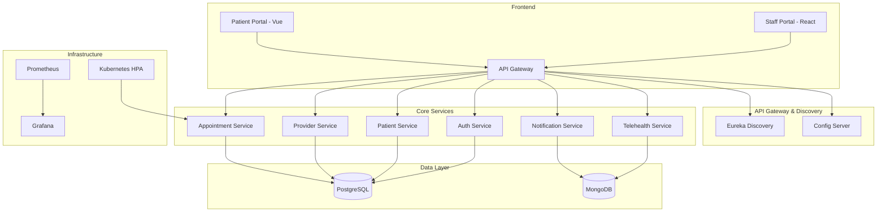

# PulseCare Telehealth Scheduler

A production-grade, horizontally scalable telehealth platform built with Spring Boot microservices, React/Vue frontends, and Kubernetes deployment.

## 🚀 Quick Start (5 minutes)

### Prerequisites
- Docker & Docker Compose
- Java 21
- Node.js 18+
- Make

### Local Development
```bash
# Clone and setup
git clone <your-repo-url>
cd pulsecare-telehealth
make init

# Start all services
make up

# Seed demo data
./scripts/local_seed.sh

# Access applications
# Staff Portal: http://localhost:3000 (admin@demo.dev / Passw0rd!)
# Patient Portal: http://localhost:3001 (patient1@demo.dev / Passw0rd!)
# API Gateway: http://localhost:8080
# Swagger UI: http://localhost:8080/swagger-ui.html
```

## 🏗️ Architecture



## 🎯 Features

- **Patient Portal**: Book, reschedule, cancel appointments
- **Provider Portal**: Manage availability and telehealth sessions
- **Secure Telehealth**: Jitsi integration with secure room generation
- **Horizontal Scaling**: Kubernetes HPA for appointment service
- **HIPAA-Friendly**: PII masking, role-based access, encryption
- **Event-Driven**: Optional Kafka integration for domain events

## 🧪 Demo Script

### 1. Provider Setup
1. Login to Staff Portal: `admin@demo.dev` / `Passw0rd!`
2. Navigate to Availability Editor
3. Create time slots for next week

### 2. Patient Booking
1. Login to Patient Portal: `patient1@demo.dev` / `Passw0rd!`
2. Browse available providers and slots
3. Book an appointment

### 3. Telehealth Session
1. Provider starts session from dashboard
2. Jitsi room opens with secure link
3. Patient joins via appointment details

### 4. Load Testing & Scaling
```bash
# Simulate traffic to trigger HPA
./scripts/load_test_hpa.sh

# Watch scaling in action
kubectl get hpa -n pulsecare
kubectl get pods -n pulsecare
```

## 🚀 Cloud Deployment

### GKE Deployment
```bash
# Setup GCP credentials
./scripts/gcp_login.sh

# Deploy to GKE
./scripts/gke_deploy.sh

# Get public URL
kubectl get ingress -n pulsecare
```

### Required Environment Variables
```bash
GCP_PROJECT_ID=your-project-id
GKE_CLUSTER=pulsecare-cluster
GKE_ZONE=us-central1-a
GCP_SA_KEY=path/to/service-account.json
GCR_REPOSITORY=gcr.io/your-project
SENDGRID_API_KEY=your-sendgrid-key
JITSI_BASE_URL=https://meet.jit.si
```

## 🛠️ Development

### Build & Test
```bash
make build      # Build all services
make test       # Run all tests
make swagger    # Export OpenAPI specs
make up         # Start local environment
make down       # Stop local environment
```

### Service Architecture
- **Backend**: Java 21 + Spring Boot 3 + Maven
- **Frontend**: React (Staff) + Vue (Patient) + Vite
- **Databases**: PostgreSQL (transactions) + MongoDB (audit)
- **Messaging**: Optional Kafka for domain events
- **Security**: JWT + Spring Security + BCrypt
- **Observability**: Actuator + Micrometer + Prometheus

## 🔒 Security & Compliance

- JWT with short TTL and refresh strategy
- PII masking in logs and traces
- Role-based access control (PATIENT, PROVIDER, ADMIN)
- TLS-ready ingress configuration
- BCrypt password hashing
- CORS locked to frontend origins

**Note**: This demo is HIPAA-friendly but not production HIPAA compliant. Full compliance requires additional controls.

## 🤖 How AI Assisted

This repository was generated using AI assistance with the following approach:

### Prompt Strategy
- Comprehensive requirements specification
- Production-grade architecture patterns
- Microservices best practices
- Kubernetes deployment strategies

### Code Review Process
- Manual review of all generated code
- Security best practices validation
- Performance optimization verification
- Testing strategy implementation

### Review Checklist
- [x] Security vulnerabilities
- [x] Performance bottlenecks
- [x] Code quality standards
- [x] Testing coverage
- [x] Documentation completeness
- [x] Deployment automation

## 📚 API Reference

- **Auth Service**: `/api/auth/*`
- **Patient Service**: `/api/patients/*`
- **Provider Service**: `/api/providers/*`
- **Appointment Service**: `/api/appointments/*`
- **Telehealth Service**: `/api/telehealth/*`
- **Notification Service**: `/api/notify/*`

Swagger UI available at: `http://localhost:8080/swagger-ui.html`

## 🧪 Testing

### Backend Tests
- Unit tests with JUnit 5
- Integration tests with Testcontainers
- Contract tests for service boundaries

### Frontend Tests
- Component tests with React Testing Library
- E2E tests with Playwright
- Visual regression testing

### Load Testing
- k6 scripts for performance validation
- HPA scaling verification
- Database performance benchmarks

## 📊 Monitoring

- Spring Boot Actuator endpoints
- Micrometer metrics for Prometheus
- Health and readiness probes
- Custom business metrics

## 🔄 CI/CD Pipeline

GitHub Actions workflow:
1. **Build & Test**: Maven + Node.js builds
2. **Docker**: Build and push to GCR
3. **Deploy**: Automatic deployment to GKE on tags

## 🆘 Troubleshooting

### Common Issues
1. **Port conflicts**: Check `docker-compose.yml` for port mappings
2. **Database connection**: Verify PostgreSQL/MongoDB are running
3. **Service discovery**: Check Eureka dashboard at `http://localhost:8761`

### Debug Commands
```bash
# Check service health
curl http://localhost:8080/actuator/health

# View logs
docker-compose logs -f [service-name]

# Database connection
docker-compose exec postgres psql -U pulsecare
```

## 📄 License

This project is for demonstration purposes. Not intended for production use without additional security and compliance measures.

## 🤝 Contributing

1. Fork the repository
2. Create a feature branch
3. Make your changes
4. Add tests
5. Submit a pull request

## 📞 Support

For questions or issues:
1. Check the troubleshooting section
2. Review the demo script
3. Check service logs
4. Verify environment configuration
